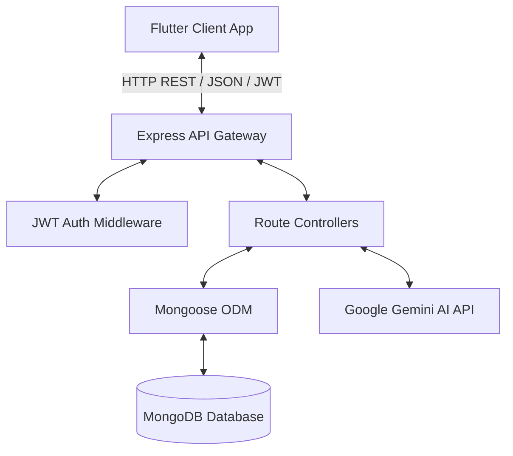

# 01. Project Overview - SmartScan Pro

SmartScan Pro is a Node.js-based REST API backend designed to automate receipt expense tracking, monthly budgeting, and financial analysis. By integrating with Google Gemini Vision AI, the application enables users to capture receipt images and automatically extract itemized pricing, store metadata, and purchase categories, which dynamically update personal monthly budgets.

---

## Business Capabilities & Features

### 1. User Authentication
Provides secure JWT-based stateless session management with password encryption.
* Hashed user credentials using `bcryptjs` with salt round parameters.
* Signed token generation with configurable session expiry (defaulting to 7 days).
* User-level profile management, currency configurations, and preferences.

### 2. Receipt Scan & AI Analysis
Processes image uploads using Google Gemini Pro Vision to perform optical character recognition (OCR).
* Accepts Base64 data from mobile clients.
* Instructs the Gemini AI model `gemini-2.5-flash` to extract key-value pairs (totals, items, tax, payment method).
* Translates non-English receipt details (specifically Sinhala) into English.
* Categorizes receipts automatically using predefined enums.

### 3. Monthly Budget Monitoring
Tracks monthly spending caps against actual purchases using database-level aggregation hooks.
* Generates monthly budget documents automatically when users register transactions.
* Triggers budget recalculation hooks on every receipt save, update, or deletion.
* Generates alert flags when monthly spending reaches 50%, 80%, or 100% of limits.

### 4. Image Gallery Vault
Manages uploaded scanned receipt photos.
* Supports custom image titles, descriptions, and tag labels.
* Links image items to parent receipt logs.
* Keeps file metadata logs (dimensions, size, format).

### 5. Social Timeline Feed
Enables networking features between users.
* Feeds posts from followed users and public visibility posts.
* Likes and comments on shared receipts.
* Manages user relationships (followers and following).

---

## Technology Stack

* **Runtime**: Node.js (v18.x standard engines)
* **Framework**: Express.js (v4.18.2)
* **Database**: MongoDB with Mongoose ODM (v7.5.0)
* **AI Model**: Google Generative AI SDK (`@google/generative-ai` v0.14.0) with model `gemini-2.5-flash`
* **Security & Utility**: Helmet, CORS, Dotenv, Bcryptjs, JSONWebToken

---

## Core System Architecture

For detailed architectural modular reviews, refer to [02_Architecture.md](file:///c:/Flutter/flutter_windows_3.41.9-stable/Smartscanner-backend-main/Smartscanner-backend-main/docs/02_Architecture.md) and [03_Backend_Architecture.md](file:///c:/Flutter/flutter_windows_3.41.9-stable/Smartscanner-backend-main/Smartscanner-backend-main/docs/03_Backend_Architecture.md).
