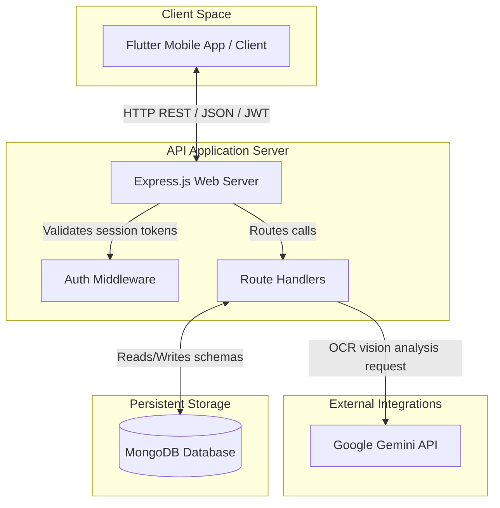

# 02. System Architecture - SmartScan Pro

This document describes the high-level system architecture, external integration layers, and communication boundaries of the SmartScan Pro application.

---

## Architecture Boundaries

The backend application functions as an API gateway and database controller, bridging the Flutter client app, MongoDB, and the Google Gemini AI vision parser.

---

## Component Boundaries

### 1. Flutter Mobile App (Client)
* Communicates with the backend using REST API endpoints.
* Handles local secure storage of JWT tokens.
* Encodes camera/gallery images to Base64 strings before transmitting them over JSON payloads.

### 2. Express.js Web Gateway (Backend Server)
* Bootstraps the application, registers global security policies (CORS, Helmet), and parses request payloads.
* Intercepts protected requests via JWT authentication middleware.
* Delegates incoming request routes to their respective controllers.

### 3. Google Gemini AI API
* Evaluates receipt validity and extracts itemized receipt fields.
* Performs OCR on Base64 image buffers.
* Translates non-English fields into English.
* Maps receipt items to category enums.

### 4. MongoDB Database Instance
* Serves as the database for the application.
* Uses Mongoose ODM to enforce schemas and index fields.
* Uses pre-save hooks to automatically aggregate monthly budgets when receipt documents change.

---

## Architectural Gaps & Maintenance Notes

> [!WARNING]
> **No Database Transaction Controls**: Receipts are saved first, and then monthly budget aggregates are updated. A database failure during the budget update will leave the database in an inconsistent state. Future iterations should implement MongoDB transactional sessions to guarantee database consistency.

> [!IMPORTANT]
> **Lack of Real Cloud Image Storage**: Although `cloudinary` is listed as a dependency, the backend currently stores Base64 string data directly to MongoDB. Storing large Base64 strings in MongoDB will cause database bloat. Future updates should refactor the upload routes to store images on Cloudinary and save the resulting URLs to MongoDB.

For detailed request-response lifecycle flows, refer to [04_Request_Flow.md](file:///c:/Flutter/flutter_windows_3.41.9-stable/Smartscanner-backend-main/Smartscanner-backend-main/docs/04_Request_Flow.md).
