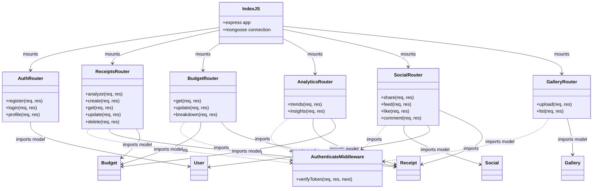

# 03. Backend Modular Architecture - SmartScan Pro

This document describes the modular architecture of the Express backend, detailing directories, module dependencies, and file responsibilities.

---

## Modular Architecture Diagram

The application uses an MVC-inspired folder layout where routes act as controllers, middleware manages access control, and models define the schema structure.

---

## File Responsibilities

### 1. Root Configurations
* **[src/index.js](file:///c:/Flutter/flutter_windows_3.41.9-stable/Smartscanner-backend-main/Smartscanner-backend-main/src/index.js)**: Configures global security parameters (Helmet, CORS policies), sets JSON body parser limits to 50MB for image transfers, registers API routes, establishes MongoDB database connection pools, and boots up the HTTP server.

### 2. Middleware Context
* **[src/middleware/authenticate.js](file:///c:/Flutter/flutter_windows_3.41.9-stable/Smartscanner-backend-main/Smartscanner-backend-main/src/middleware/authenticate.js)**: Verifies JWT token signatures in HTTP request headers. Appends the decoded user ID to the request object (`req.userId`) to authorize access to protected routes.

### 3. Models Layer (Mongoose)
* **[User.js](file:///c:/Flutter/flutter_windows_3.41.9-stable/Smartscanner-backend-main/Smartscanner-backend-main/src/models/User.js)**: Defines fields for user credentials, hashes passwords using a pre-save hook, and manages following relationships.
* **[Receipt.js](file:///c:/Flutter/flutter_windows_3.41.9-stable/Smartscanner-backend-main/Smartscanner-backend-main/src/models/Receipt.js)**: Schema for items, stores, raw Base64 image strings, and AI validation metadata.
* **[Budget.js](file:///c:/Flutter/flutter_windows_3.41.9-stable/Smartscanner-backend-main/Smartscanner-backend-main/src/models/Budget.js)**: Automatically aggregates spending totals, category breakdowns, and alert levels using a pre-save hook.
* **[Gallery.js](file:///c:/Flutter/flutter_windows_3.41.9-stable/Smartscanner-backend-main/Smartscanner-backend-main/src/models/Gallery.js)**: Manages gallery vault backups, metadata configurations, and linked receipt IDs.
* **[Social.js](file:///c:/Flutter/flutter_windows_3.41.9-stable/Smartscanner-backend-main/Smartscanner-backend-main/src/models/Social.js)**: Schema for shared timeline posts, likes arrays, and comments subdocuments.

### 4. Router Handlers (Controllers)
* **[auth.js](file:///c:/Flutter/flutter_windows_3.41.9-stable/Smartscanner-backend-main/Smartscanner-backend-main/src/routes/auth.js)**: Manages user registration, login operations, and profile updates.
* **[receipts.js](file:///c:/Flutter/flutter_windows_3.41.9-stable/Smartscanner-backend-main/Smartscanner-backend-main/src/routes/receipts.js)**: Directs AI vision extraction, manual logs, and receipt deletions.
* **[budget.js](file:///c:/Flutter/flutter_windows_3.41.9-stable/Smartscanner-backend-main/Smartscanner-backend-main/src/routes/budget.js)**: Manages monthly limits and spending breakdowns.
* **[analytics.js](file:///c:/Flutter/flutter_windows_3.41.9-stable/Smartscanner-backend-main/Smartscanner-backend-main/src/routes/analytics.js)**: Computes historical charts, store frequencies, and budget health alerts.
* **[social.js](file:///c:/Flutter/flutter_windows_3.41.9-stable/Smartscanner-backend-main/Smartscanner-backend-main/src/routes/social.js)**: Coordinates shared timelines, follows, likes, and comments.
* **[gallery.js](file:///c:/Flutter/flutter_windows_3.41.9-stable/Smartscanner-backend-main/Smartscanner-backend-main/src/routes/gallery.js)**: Manages user image backups and tag filters.

---

## Maintenance Notes & Refactoring Guidelines

> [!TIP]
> **Decouple the Service Layer**: Business logic (such as calling the Google Gemini API in `receipts.js` or parsing dates) is currently written inline within the routes. Future updates should extract this logic into a dedicated service layer (e.g. `src/services/geminiService.js`) to keep route controller files clean and maintainable.

For details on request routing lifecycles and middleware execution orders, refer to [04_Request_Flow.md](file:///c:/Flutter/flutter_windows_3.41.9-stable/Smartscanner-backend-main/Smartscanner-backend-main/docs/04_Request_Flow.md).
