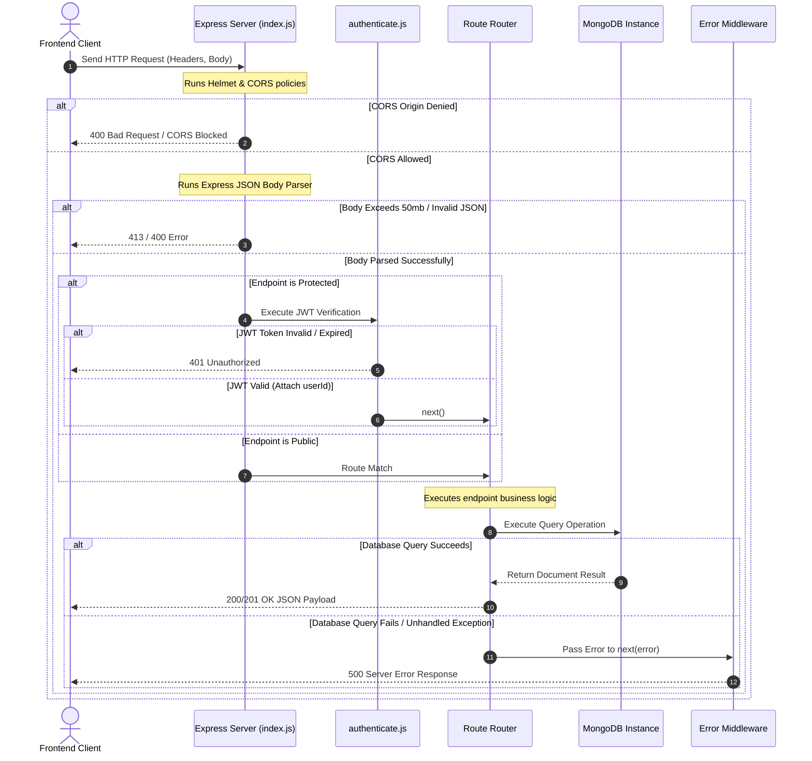

# 04. Request Flow & Lifecycles - SmartScan Pro

This document maps the lifecycle of an incoming HTTP request through the SmartScan Pro Express server.

---

## Request Lifecycle Flowchart

The diagram below tracks the filters, middleware checks, routing layers, and error interceptors that process an API request:



---

## Execution Layers

### 1. Security & Parsing Filters
Every incoming request is processed by global middlewares registered in [src/index.js](file:///c:/Flutter/flutter_windows_3.41.9-stable/Smartscanner-backend-main/Smartscanner-backend-main/src/index.js):
* **Helmet**: Injects security headers to defend against clickjacking and scripting threats.
* **CORS**: Filters request origins against the `FRONTEND_URL` environment variable (default: `http://localhost:8080`).
* **JSON Body Parser**: Parses JSON request bodies with a size limit of `50mb` to allow Base64 receipt image uploads.

### 2. Authorization Interceptor
Protected routes import [src/middleware/authenticate.js](file:///c:/Flutter/flutter_windows_3.41.9-stable/Smartscanner-backend-main/Smartscanner-backend-main/src/middleware/authenticate.js) to verify access:
* Parses authorization headers for `Bearer <JWT_TOKEN>`.
* Verifies token signatures using `JWT_SECRET`.
* If verified, decodes the payload, injects `req.userId`, and calls `next()`.
* If invalid or missing, rejects the request with a `401 Unauthorized` status.

### 3. Route Controller
Processes request parameters, interacts with database models using Mongoose, and triggers external services (like the Gemini API).

### 4. Global Error Handler
If an unhandled exception occurs inside a controller, it is caught by the global error handler middleware:
```javascript
app.use((err, req, res, next) => {
  console.error(err.stack);
  res.status(err.status || 500).json({
    error: {
      message: err.message,
      status: err.status || 500
    }
  });
});
```
This logs the error stack trace and returns a standardized JSON error response.

---

## Maintenance Notes & Operational Risks

> [!WARNING]
> **Large Payload Memory Spikes**: The JSON parser limit is set to a high threshold of `50mb` to accommodate Base64 receipt uploads. Processing large image strings inside request bodies can cause high network latency and CPU spikes on the API server. In production, we recommend compressing images client-side before upload.

For database model definitions and collection schemas, refer to [05_Database_Design.md](file:///c:/Flutter/flutter_windows_3.41.9-stable/Smartscanner-backend-main/Smartscanner-backend-main/docs/05_Database_Design.md).
