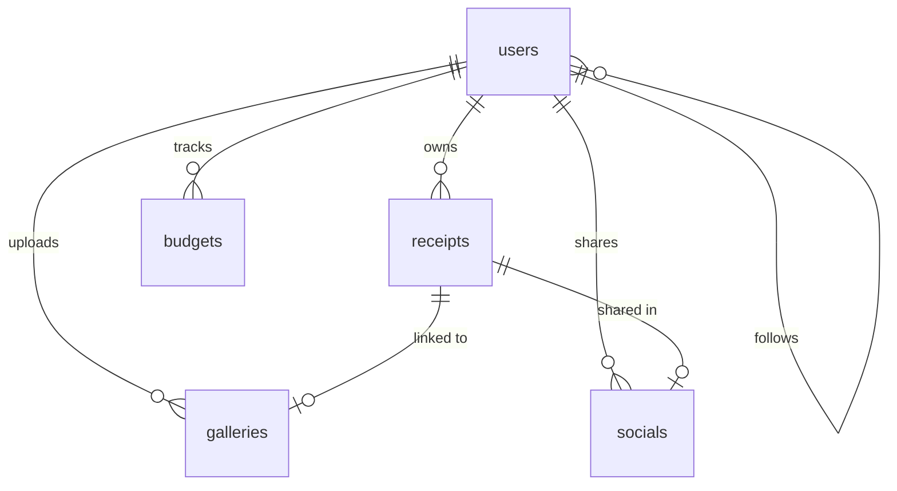

# 05. Database Design - SmartScan Pro

This document describes the database schemas, field definitions, relationships, and index configurations for MongoDB.

---

## Entity Relationship Diagram (ERD)

---

## Database Schema Specification

---

### 1. `users` Collection
Stores user profile configurations, credentials, notifications settings, and social relations.

* **Field Mapping**:
  * `_id` (ObjectId): Unique document identifier.
  * `name` (String, Required): Plaintext name of the user.
  * `email` (String, Required, Unique, Lowercase): Account login email.
  * `password` (String, Required): Hashed password.
  * `profilePicture` (String): URL of the user's profile image.
  * `monthlyBudget` (Number, Default: `20000`): Default monthly spending cap.
  * `currency` (String, Default: `'Rs'`): Selected currency symbol.
  * `preferences` (Sub-document):
    * `notifications` (Boolean, Default: `true`): Toggle budget warning alerts.
    * `theme` (String, Default: `'dark'`): User interface theme mode.
  * `followers` (Array of ObjectIds referencing `users`): Users following this profile.
  * `following` (Array of ObjectIds referencing `users`): Users followed by this profile.
  * `createdAt` (Date): Account creation timestamp.
  * `updatedAt` (Date): Account update timestamp.
* **Indexes**:
  * `email_1` (Unique): Enforces single account registration per email.
* **Lifecycle Hooks**: Hashes passwords using `bcryptjs` (work factor: 10) in a pre-save hook before writing to MongoDB.

---

### 2. `receipts` Collection
Stores scanned receipt details, item lists, image urls, and AI confidence metadata.

* **Field Mapping**:
  * `_id` (ObjectId): Unique document identifier.
  * `userId` (ObjectId referencing `users`, Required): Owner ID of the receipt.
  * `storeName` (String, Required): Store or vendor name.
  * `date` (Date, Default: `Date.now`): Transaction date.
  * `total` (Number, Required): Total purchase amount.
  * `items` (Array of Sub-documents):
    * `name` (String): Purchased item name.
    * `quantity` (Number): Item count.
    * `price` (Number): Price per item.
    * `category` (String): Item category classification.
  * `imageUrl` (String): Cloud image hosting URL.
  * `rawImageData` (String): Scanned image raw Base64 string.
  * `analysisData` (Sub-document):
    * `extractedText` (String): Raw OCR text.
    * `confidence` (Number): Accuracy score percentage (0-100).
    * `paymentMethod` (String): Extracted payment method (e.g. Card, Cash).
    * `taxAmount` (Number): Extracted tax amount.
  * `category` (String, Enum, Default: `'Other'`): Must match category enums: `['Food', 'Furniture', 'Stationery', 'Medicine', 'BabyAccessories', 'MobileAccessories', 'PetItems', 'BankPayment', 'Transport', 'Other']`.
  * `tags` (Array of Strings): Custom tags.
  * `notes` (String): Notes or annotations.
  * `isShared` (Boolean, Default: `false`): Shared status.
  * `sharedWith` (Array of ObjectIds referencing `users`): Users shared with directly.
* **Indexes**:
  * `{ userId: 1, createdAt: -1 }`: Compound index to optimize list queries by user, sorted by creation date.

---

### 3. `budgets` Collection
Tracks monthly spending limits, category totals, and status warnings.

* **Field Mapping**:
  * `_id` (ObjectId): Unique document identifier.
  * `userId` (ObjectId referencing `users`, Required): Target user ID.
  * `month` (String, Required, Format: `YYYY-MM`): Target month.
  * `budget` (Number, Required): Spending limit.
  * `spent` (Number, Default: `0`): Sum of receipt totals in the month.
  * `remaining` (Number): Balance (`budget - spent`).
  * `categoryBreakdown` (Sub-document with key numbers representing each Receipt Category enum): `Food`, `Furniture`, `Stationery`, `Medicine`, `BabyAccessories`, `MobileAccessories`, `PetItems`, `BankPayment`, `Transport`, `Other`.
  * `alerts` (Sub-document):
    * `budgetExceeded` (Boolean, Default: `false`): True if spent > budget.
    * `at80Percent` (Boolean, Default: `false`): True if spent >= budget * 0.8.
    * `at50Percent` (Boolean, Default: `false`): True if spent >= budget * 0.5.
* **Indexes**:
  * `{ userId: 1, month: 1 }` (Unique): Compound index enforcing a single budget record per user-month.
* **Lifecycle Hooks**: Employs a Mongoose `pre('save')` hook to automatically calculate category breakdowns, spent totals, and warning alerts before saving the budget document.

---

### 4. `galleries` Collection
Document vault for backup receipt images.

* **Field Mapping**:
  * `_id` (ObjectId): Unique document identifier.
  * `userId` (ObjectId referencing `users`, Required): Owner ID of the image.
  * `imageUrl` (String, Required): Scanned image raw Base64 string.
  * `rawImageData` (String): Scanned image raw Base64 string.
  * `thumbnailUrl` (String): Thumbnail URL.
  * `title` (String): Image title.
  * `description` (String): Description or notes.
  * `tags` (Array of Strings): Custom labels.
  * `receipt` (ObjectId referencing `receipts`): Linked receipt ID.
  * `metadata` (Sub-document): `{ width, height, size, format }`.
  * `timestamp` (Date, Default: `Date.now`): Upload timestamp.
* **Indexes**:
  * `{ userId: 1, timestamp: -1 }`: Compound index to optimize list queries by user, sorted by upload date.

---

### 5. `socials` Collection
Stores shared feed posts, comments, and likes.

* **Field Mapping**:
  * `_id` (ObjectId): Unique document identifier.
  * `userId` (ObjectId referencing `users`, Required): Post author ID.
  * `receiptId` (ObjectId referencing `receipts`, Required): Linked receipt ID.
  * `description` (String): Description or status text.
  * `likes` (Array of ObjectIds referencing `users`): Users who liked the post.
  * `comments` (Array of Sub-documents):
    * `userId` (ObjectId referencing `users`): Author of the comment.
    * `text` (String): Comment text.
    * `createdAt` (Date, Default: `Date.now`): Comment creation timestamp.
  * `visibility` (String, Enum, Default: `'private'`): Visibility setting (`private`, `friends`, `public`).
* **Indexes**:
  * `{ userId: 1, createdAt: -1 }`: Compound index to optimize timeline queries.
  * `{ visibility: 1, createdAt: -1 }`: Compound index to optimize feed queries by visibility scope, sorted by date.

---

## Maintenance Notes & Performance Risks

> [!WARNING]
> **No Index on Date Field for Trends Query**: The trends endpoint in [analytics.js](file:///c:/Flutter/flutter_windows_3.41.9-stable/Smartscanner-backend-main/Smartscanner-backend-main/src/routes/analytics.js) queries receipt dates using `{ userId, date: { $gte: startDate } }`. However, there is no index on the `date` field in [Receipt.js](file:///c:/Flutter/flutter_windows_3.41.9-stable/Smartscanner-backend-main/Smartscanner-backend-main/src/models/Receipt.js), which will result in index scans instead of point queries as the database grows. We recommend adding a compound index on `{ userId: 1, date: -1 }`.

> [!CAUTION]
> **Comments Array Size Limit**: Comments are stored inside the social post document as a nested array of subdocuments. High comment volumes can exceed MongoDB's maximum document size limit of 16MB. We recommend moving comments out of the social document into a dedicated, paginated collection.

For details on API routes and request formats, refer to [06_API_Documentation.md](file:///c:/Flutter/flutter_windows_3.41.9-stable/Smartscanner-backend-main/Smartscanner-backend-main/docs/06_API_Documentation.md).
