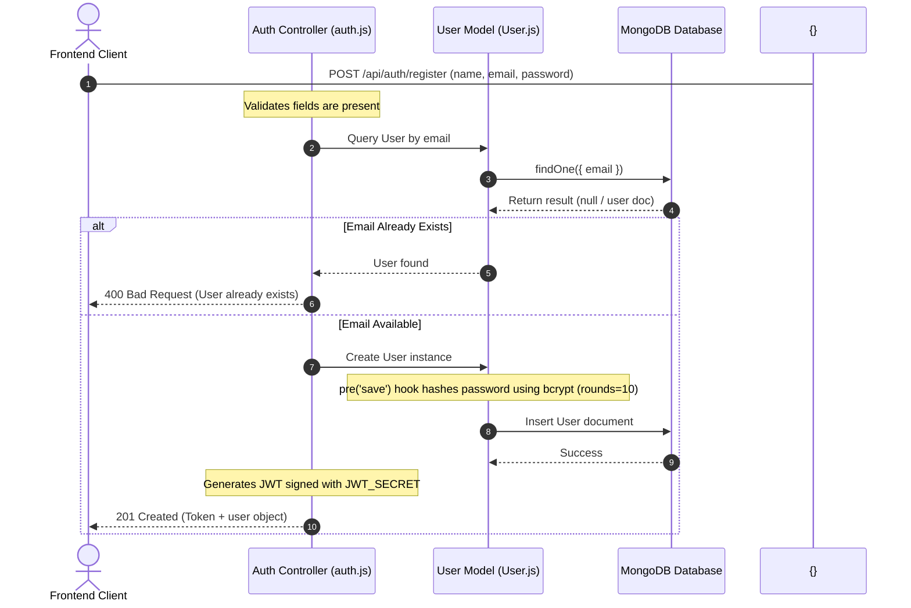
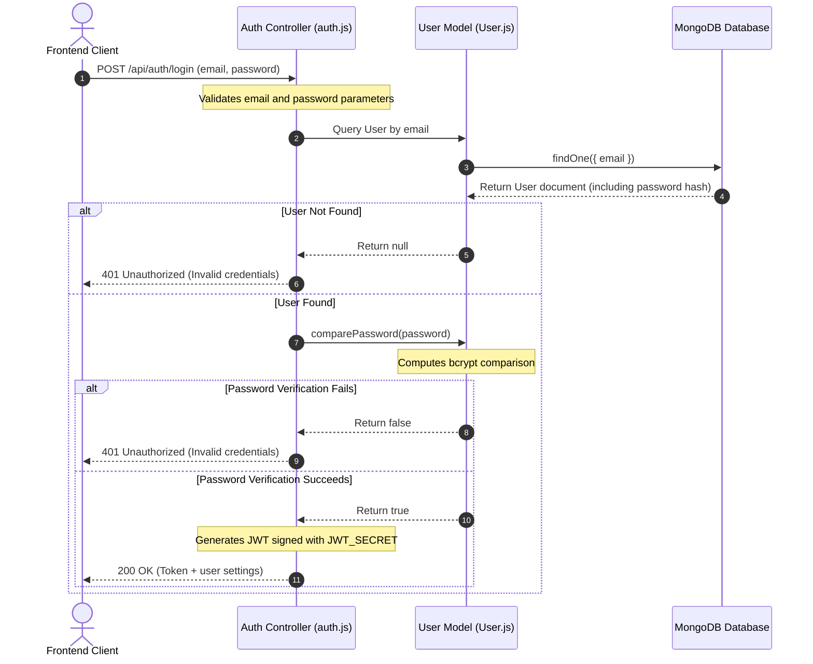
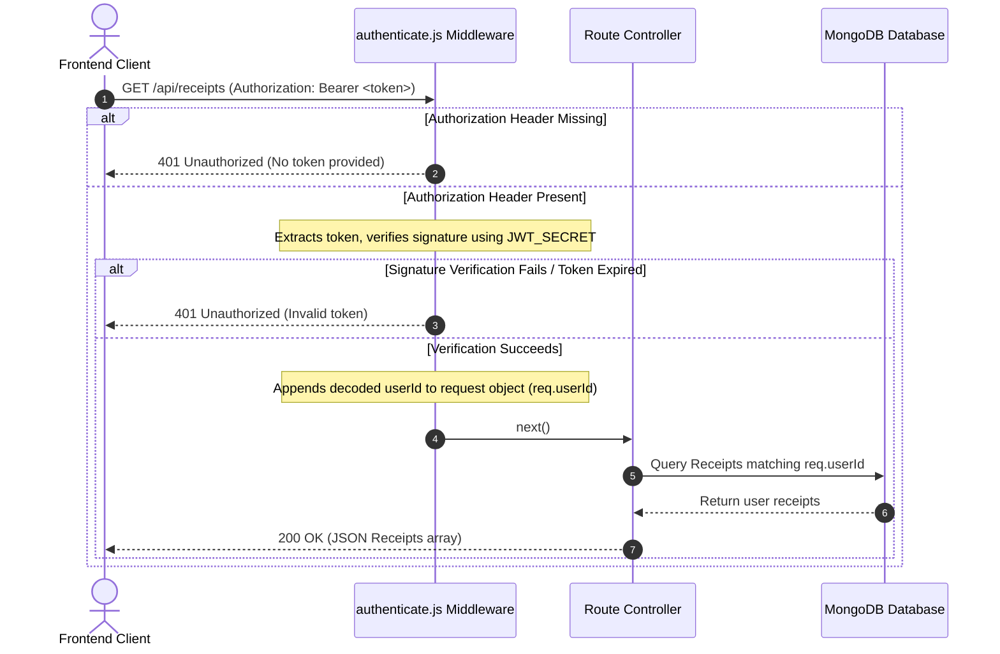

# 07. Authentication System - SmartScan Pro

This document details the stateless JWT authentication system, password encryption, and authorization checks.

---

## Authentication Sequences

### 1. User Registration Flow


### 2. User Login Flow


### 3. Authorization Hook Lifecycle


---

## Authentication Specifications

### 1. Password Hashing Engine
* **Library**: `bcryptjs`
* **Configuration**: Cost rounds set to `10` inside the User model pre-save hook.
* **Mechanism**:
  ```javascript
  userSchema.pre('save', async function(next) {
    if (!this.isModified('password')) return next();
    this.password = await bcrypt.hash(this.password, 10);
    next();
  });
  ```

### 2. Token Lifecycle (JWT Generation)
* **Library**: `jsonwebtoken`
* **Payload**: Extracted user document ID: `{ userId: user._id }`.
* **Signing Key**: Server secret key (`process.env.JWT_SECRET`).
* **Expiration**: Configured via `JWT_EXPIRE` (defaulting to `7d`).

### 3. Token Verification (Authentication Middleware)
* Intercepts incoming requests on protected endpoints.
* Parses request headers for the `Authorization` bearer token.
* Calls `jwt.verify(token, process.env.JWT_SECRET)` to validate the token.
* Injects the decoded user ID into `req.userId` for route controllers.

---

## Maintenance Notes & Operational Risks

> [!WARNING]
> **No Password Complexity Rules**: The schema only enforces a minimum length of 6 characters. We recommend implementing password validation regex rules to require uppercase letters, numbers, and special characters.

> [!CAUTION]
> **Lack of Token Revocation**: The JWT system is stateless, meaning tokens cannot be revoked before they expire. If a token is compromised, it remains valid until it expires. We recommend implementing a token blacklist using Redis to handle user logouts and account deletions.

For details on the receipt scan pipeline and Gemini AI integrations, refer to [08_Receipt_Analysis.md](file:///c:/Flutter/flutter_windows_3.41.9-stable/Smartscanner-backend-main/Smartscanner-backend-main/docs/08_Receipt_Analysis.md).
