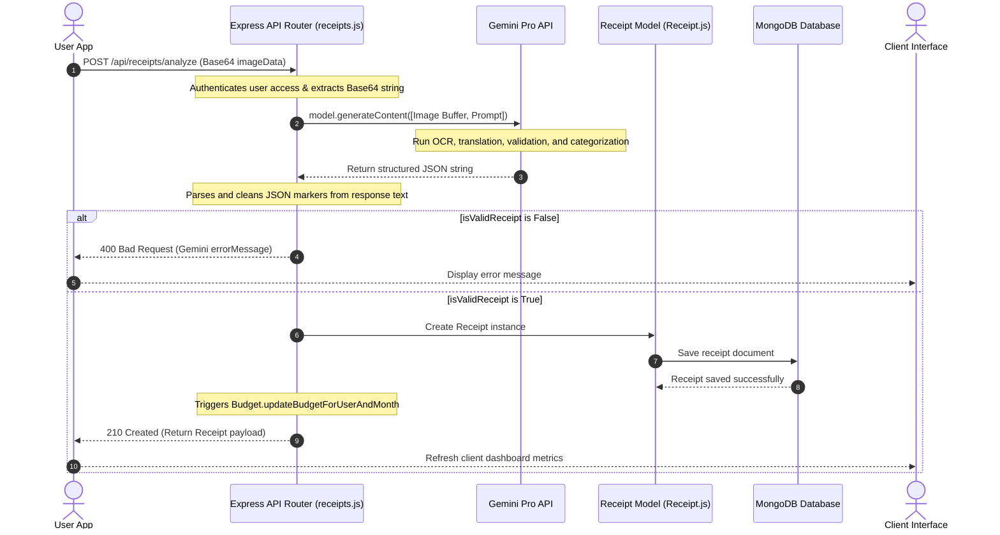

# 08. AI Receipt Analysis - SmartScan Pro

This document describes the Gemini AI vision integration, prompts, image data processing, validation, and parsing logic.

---

## Receipt Analysis Sequence Diagram



---

## Implementation Details

### 1. SDK Initialization
We dynamically load the `@google/generative-ai` SDK client within a try-catch block inside [src/routes/receipts.js](file:///c:/Flutter/flutter_windows_3.41.9-stable/Smartscanner-backend-main/Smartscanner-backend-main/src/routes/receipts.js) to prevent runtime server crashes if the library is missing:
```javascript
let genAI = null;
try {
  const { GoogleGenerativeAI } = require('@google/generative-ai');
  genAI = new GoogleGenerativeAI(process.env.GEMINI_API_KEY);
} catch (error) {
  console.warn('Google Gemini SDK not available. /api/receipts/analyze will be disabled.', error.message);
}
```

### 2. Prompt Architecture
The analysis prompt instructs the `gemini-2.5-flash` model to return a structured JSON response matching the following rules:
* **Validation**: Check if the uploaded image represents a valid, readable receipt (not too blurry, too dark, or representing unrelated objects).
* **Translation**: If the receipt is in Sinhala, translate the store name, item names, and categories to English.
* **Schema Match**: Extract fields into a strict JSON schema containing `storeName`, `total`, `items`, `taxAmount`, `paymentMethod`, and `confidence`, and map the category to one of our allowed enums.

### 3. Image Input Format
The route accepts Base64 image payloads, strips the header prefix, converts the payload to binary buffers, and sends it to Gemini:
```javascript
const base64Data = imageData.replace(/^data:image\/\w+;base64,/, '');
const imageBuffer = Buffer.from(base64Data, 'base64');
```

The payload is sent to Gemini as an `inlineData` structure with the MIME type hardcoded to `image/jpeg`.

### 4. Output Parsing
The route strips Markdown code blocks from Gemini's text response before parsing the JSON string:
```javascript
const analysisText = result.response.text();
const cleanText = analysisText.replace(/```json|```/g, '').trim();
const analysisData = JSON.parse(cleanText);
```

---

## Maintenance Notes & Operational Risks

> [!WARNING]
> **No Retry Strategy**: The integration does not implement retry logic. If the Gemini API fails due to rate limits or network issues, the request will immediately fail and return a `500` error to the client. We recommend implementing retry logic with exponential backoff.

> [!IMPORTANT]
> **JSON Parsing Failures**: If Gemini returns invalid JSON or if code block patterns vary (e.g. ` ```JSON ` with uppercase letters), the parsing logic will fail and throw a 500 error.

For details on how receipts trigger monthly budget updates, refer to [09_Budget_Module.md](file:///c:/Flutter/flutter_windows_3.41.9-stable/Smartscanner-backend-main/Smartscanner-backend-main/docs/09_Budget_Module.md).
