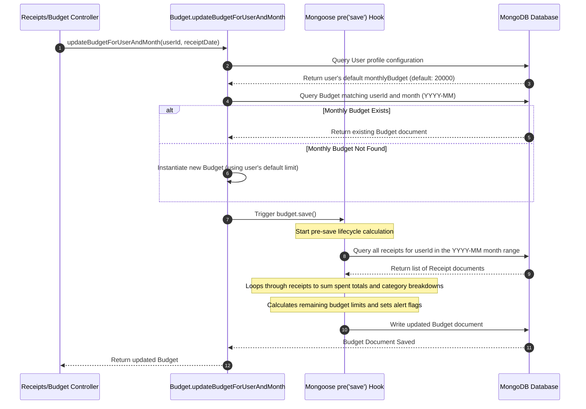

# 09. Budget Tracking Module - SmartScan Pro

This document describes how the budget tracking system dynamically aggregates monthly spending, updates category breakdowns, and triggers alert warnings.

---

## Budget Tracking Sequence Flow



---

## Business Logic & Execution

### 1. Static Update Trigger
When a user adds, edits, or deletes a receipt, the receipts controller calls:
```javascript
await Budget.updateBudgetForUserAndMonth(req.userId, receipt.date);
```

This helper method locates the target month's budget (or falls back to the user's default monthly limit) and saves the document:
```javascript
let budget = await this.findOne({ userId, month: monthKey });
if (!budget) {
  budget = new this({
    userId,
    month: monthKey,
    budget: defaultBudget
  });
}
await budget.save(); // Triggers pre-save hooks
```

### 2. Mongoose Pre-Save Calculations
Saving the budget document triggers a `pre('save')` hook inside [Budget.js](file:///c:/Flutter/flutter_windows_3.41.9-stable/Smartscanner-backend-main/Smartscanner-backend-main/src/models/Budget.js):
1. **Fetch Receipts**: Queries all receipts logged by the user in the target month:
   ```javascript
   const receipts = await Receipt.find({
     userId: this.userId,
     date: { $gte: startDate, $lte: endDate }
   });
   ```
2. **Sum Spent Totals**: Sums the total spent across all receipts and groups them by category:
   ```javascript
   receipts.forEach(receipt => {
     const category = receipt.category || 'Other';
     if (breakdown.hasOwnProperty(category)) {
       breakdown[category] += receipt.total;
     } else {
       breakdown.Other += receipt.total;
     }
     totalSpent += receipt.total;
   });
   ```
3. **Set Warning Flags**: Compares overall spending to the monthly budget limit and sets alert flags:
   * `alerts.at50Percent`: True if spent >= 50% of the budget limit.
   * `alerts.at80Percent`: True if spent >= 80% of the budget limit.
   * `alerts.budgetExceeded`: True if spent exceeds the budget limit.

---

## Maintenance Notes & Operational Risks

> [!WARNING]
> **Pre-Save Calculations Race Condition**: The budget calculations are performed in a Mongoose hook. Rapid sequential receipt uploads can trigger race conditions because MongoDB documents are read, modified, and saved without transactional locking. We recommend refactoring this logic to use MongoDB update operators (like `$inc`) instead of retrieving and saving entire documents.

> [!TIP]
> **Duplicate Database Queries**: The category breakdown endpoint (`GET /api/budget/:month/breakdown`) manually queries all receipts, duplicating the calculation logic defined in the budget pre-save hook. We recommend refactoring this route to retrieve the breakdown values directly from the stored budget document.

For details on the analytics engine and insights APIs, refer to [10_Analytics_Module.md](file:///c:/Flutter/flutter_windows_3.41.9-stable/Smartscanner-backend-main/Smartscanner-backend-main/docs/10_Analytics_Module.md).
