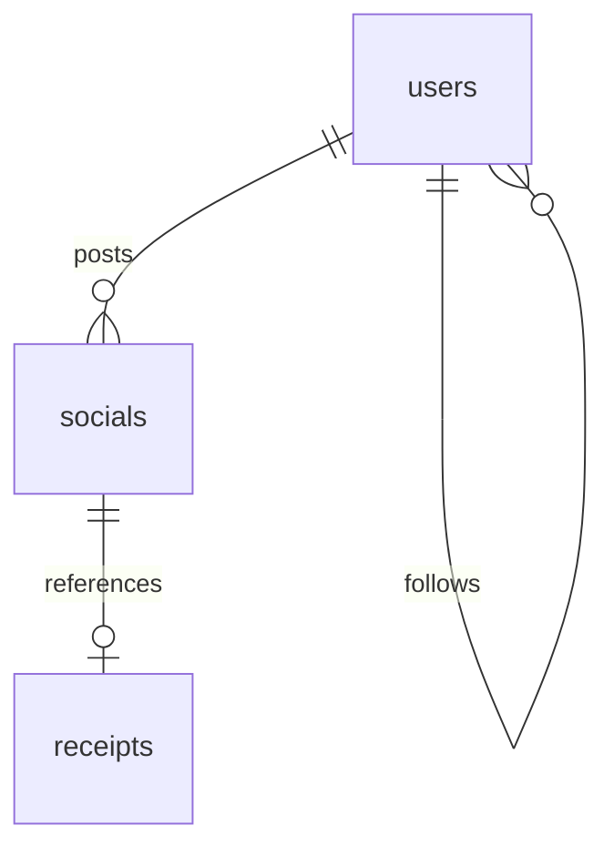

# 11. Social Module - SmartScan Pro

This document describes the social network features, followers/following profiles, feeds timeline, comments, and likes.

---

## Social Features Design

The social features are managed in [src/routes/social.js](file:///c:/Flutter/flutter_windows_3.41.9-stable/Smartscanner-backend-main/Smartscanner-backend-main/src/routes/social.js) and are supported by the `Social` and `User` database models:



---

## Technical Workflows

### 1. Compiling the Timeline Feed (`GET /feed`)
The feed is generated by querying posts that match specific visibility scopes:
1. **Fetch Profile Details**: Retrieves the user's followed list from their profile:
   ```javascript
   const user = await User.findById(req.userId);
   ```
2. **Retrieve Feed Posts**: Queries the `Social` collection using a logical OR operator to fetch posts that are:
   * Created by the user.
   * Created by followed users (with visibility set to `public` or `friends`).
   * Created by any user with visibility set to `public`.
   ```javascript
   const shares = await Social.find({
     $or: [
       { userId: req.userId },
       { userId: { $in: user.following }, visibility: { $in: ['public', 'friends'] } },
       { visibility: 'public' }
     ]
   })
   .populate('userId', 'name email profilePicture')
   .populate('receiptId')
   .sort({ createdAt: -1 })
   .limit(50);
   ```
3. Returns the populated post objects, sorted in descending chronological order.

### 2. Likes Management (`POST /:shareId/like`)
Likes are tracked using an array of user IDs inside the social post document:
* If the user ID exists in the `likes` array, we remove it (unlike).
* If the user ID does not exist in the `likes` array, we add it (like).
* Saves the post and returns the updated likes count to the client.

### 3. Comments Management (`POST /:shareId/comment`)
Comments are stored inside the social post document as a nested array of subdocuments:
```javascript
const share = await Social.findByIdAndUpdate(
  req.params.shareId,
  { $push: { comments: { userId: req.userId, text } } },
  { new: true }
).populate('comments.userId', 'name profilePicture');
```
This appends the comment to the array and populates the commenter's profile details.

### 4. Following Connections (`POST /users/:targetUserId/follow`)
Follow connections update follow state on both the user and the target user:
* Adds/removes the target user's ID to the current user's `following` array.
* Adds/removes the current user's ID to the target user's `followers` array.
* Saves both user profiles back to MongoDB.

---

## Maintenance Notes & Operational Risks

> [!WARNING]
> **No Timeline Pagination**: Feed queries fetch posts without pagination parameters. As the database grows, this will cause slow feed loads and high network bandwidth consumption. We recommend refactoring this query to support cursor-based or offset pagination.

> [!CAUTION]
> **Dual Updates Without Transaction Safety**: The follow endpoint updates two user documents sequentially without using database transactions. A database failure mid-operation will leave the follow states out of sync. We recommend wrapping this operation in a database transaction session.

For setup and development workspace configurations, refer to [12_Development_Guide.md](file:///c:/Flutter/flutter_windows_3.41.9-stable/Smartscanner-backend-main/Smartscanner-backend-main/docs/12_Development_Guide.md).
