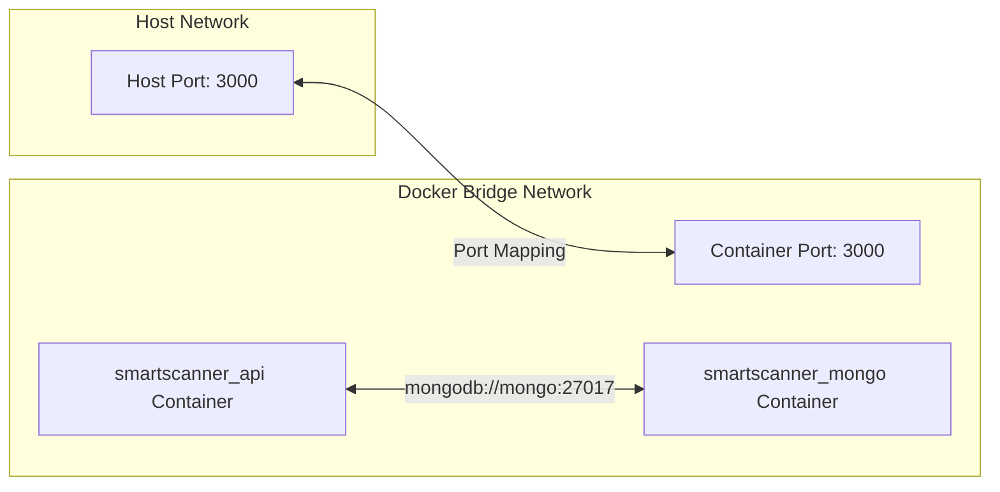

# 13. Deployment & DevOps Guide - SmartScan Pro

This document describes how to deploy the backend application using Docker and provides a production deployment checklist.

---

## 1. DOCKER ARCHITECTURE

We use Docker to package the application and its dependencies into standardized containers:



### Dockerfile
The [Dockerfile](file:///c:/Flutter/flutter_windows_3.41.9-stable/Smartscanner-backend-main/Smartscanner-backend-main/Dockerfile) uses an alpine-based Node image to minimize container sizes:
```dockerfile
FROM node:18-alpine
WORKDIR /app
COPY package*.json ./
RUN npm install --production
COPY . .
EXPOSE 3005
CMD ["npm", "start"]
```

---

## 2. DOCKER COMPOSE CONFIGURATION

To run the application locally using Docker Compose, make sure you configure your `.env` file first.

Run the following command to build and start the containers:
```bash
docker-compose up --build
```

### Port Mapping Discrepancy
> [!WARNING]
> **Container Port Mapping Mismatch**: In [docker-compose.yml](file:///c:/Flutter/flutter_windows_3.41.9-stable/Smartscanner-backend-main/Smartscanner-backend-main/docker-compose.yml), the API service maps port `3000:3000` to the host and runs `npm run dev`. However, the environment block does not define `PORT=3000`. As a result, [index.js](file:///c:/Flutter/flutter_windows_3.41.9-stable/Smartscanner-backend-main/Smartscanner-backend-main/src/index.js) defaults to port `3005`. This port mismatch prevents docker-compose from forwarding requests correctly.
>
> **Fix**: Set `PORT=3000` inside the `environment` block for the `api` service in `docker-compose.yml`.

---

## 3. PRODUCTION DEPLOYMENT CHECKLIST

Ensure you complete the following tasks before deploying the application to production:

* **Production Variables**:
  * Set `NODE_ENV=production`.
  * Set `JWT_SECRET` to a high-entropy secret key.
  * Define `PORT` dynamically to bind the listener port.
  * Set `MONGODB_URI` to point to a managed database instance (like MongoDB Atlas).
  * Confirm that `GEMINI_API_KEY` is configured correctly.
* **CORS Settings**: Update `FRONTEND_URL` in your environment settings to restrict API access to your production domain origin.
* **Database Indexes**: Verify all database indexes are built successfully on your production database instance.
* **Logs & Monitoring**: Configure structured logs (such as Winston) and connect your server to an APM monitor (like PM2, Datadog, or New Relic) to track error rates.

For developer maintenance recommendations and refactoring guidelines, refer to [14_Maintenance_Guide.md](file:///c:/Flutter/flutter_windows_3.41.9-stable/Smartscanner-backend-main/Smartscanner-backend-main/docs/14_Maintenance_Guide.md).
